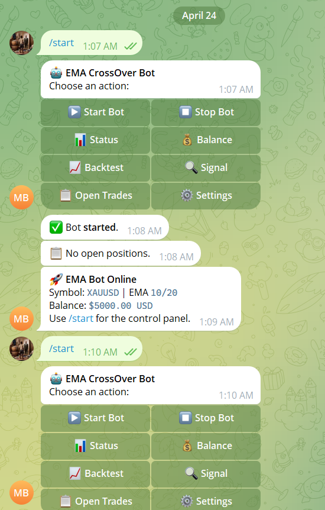
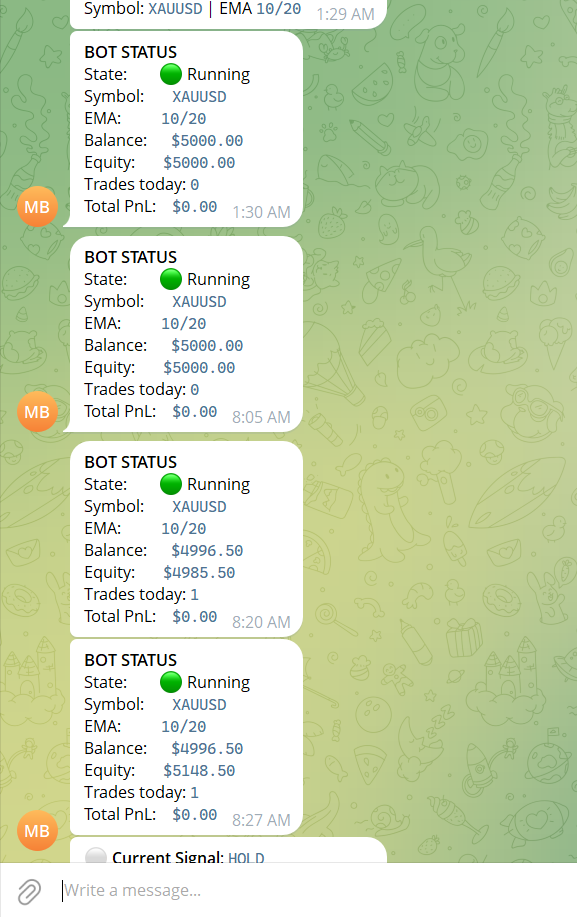
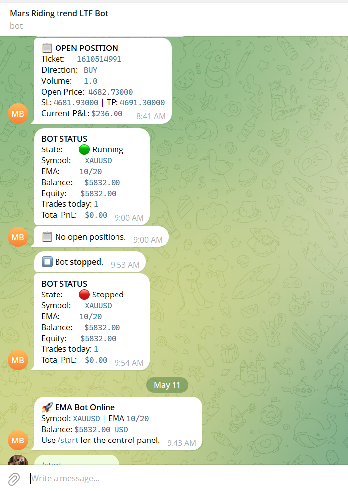
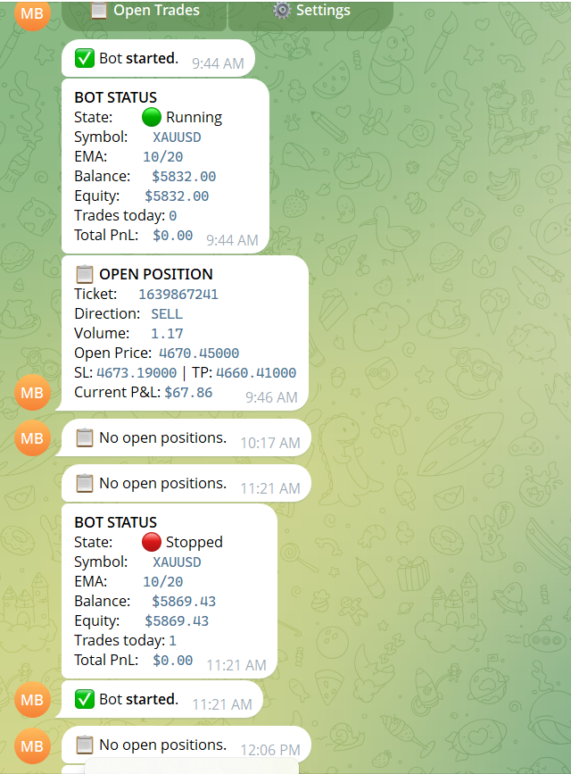
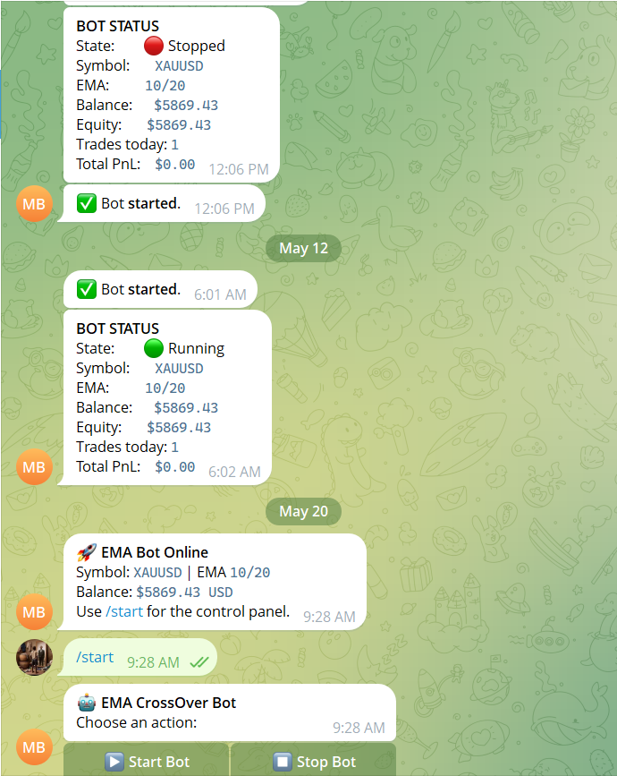
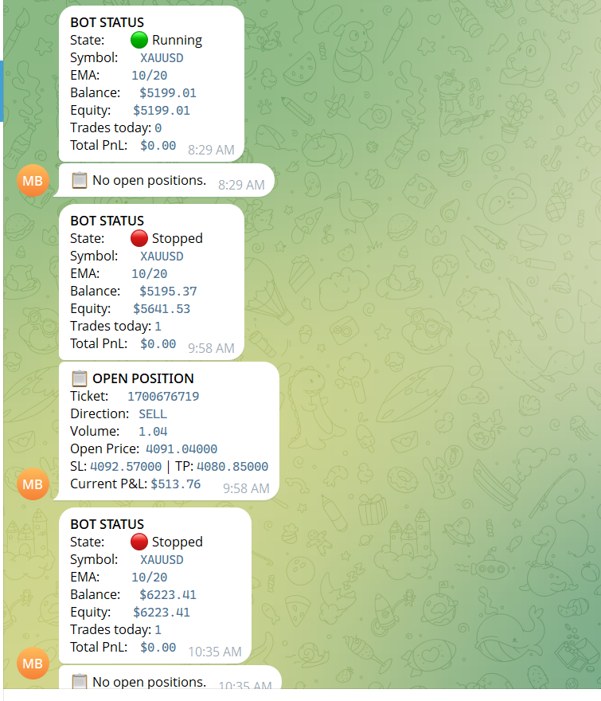
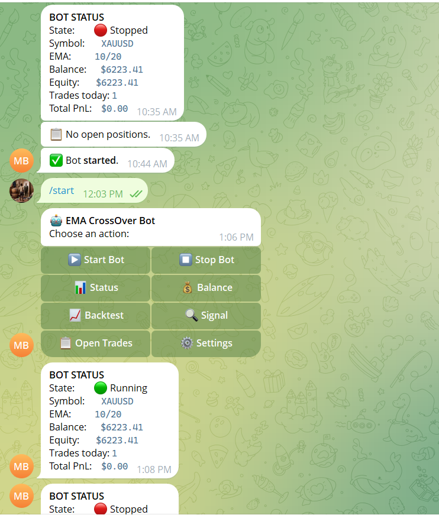
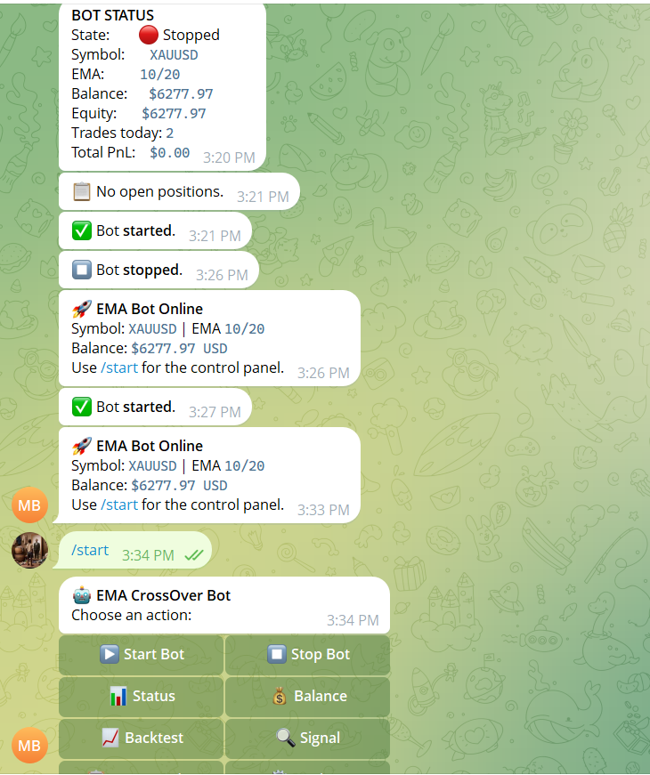
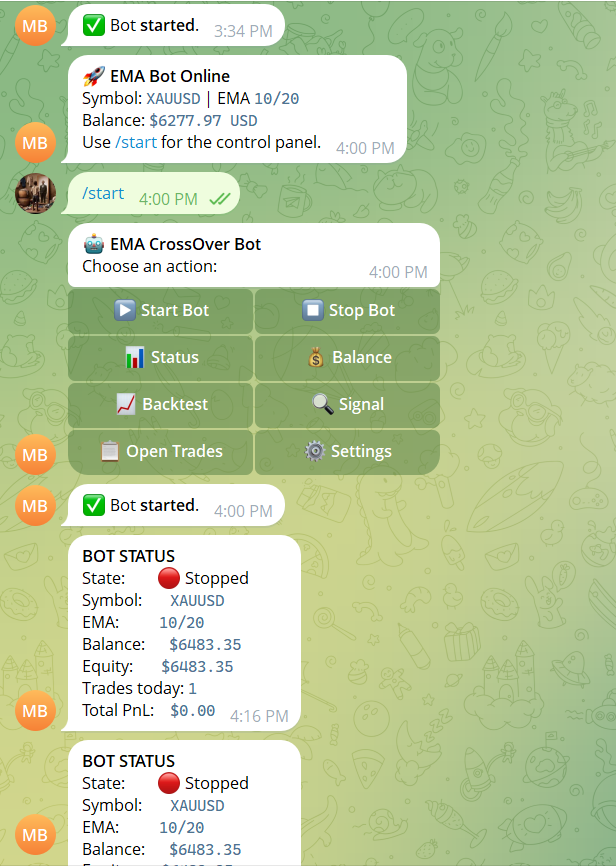
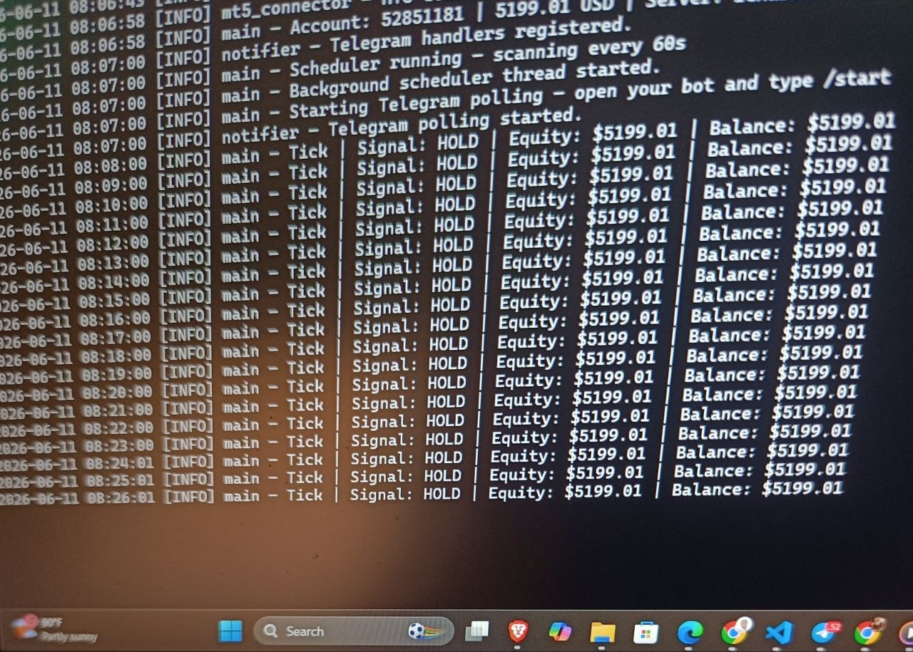

# Riding the Trend Momentum Trading Bot 
Momentum based trading bot that rides the trend using Exponential Moving Average Crossover

**Core functionalities of the Bot:**

- Connects to any MT5 broker — demo or live
- Scans for EMA crossover signals on a configurable interval
- Automatically opens, manages, and closes trades
- Sizes each position dynamically based on your account balance and risk tolerance
- Protects every trade with Stop Loss, Take Profit, and optional Trailing Stop
- Halts automatically if your maximum drawdown threshold is breached
- Sends real-time Telegram alerts for every trade event
- Provides a full Telegram control panel to start, stop, and monitor the bot from your phone
- Runs vectorised backtests and parameter optimisation on demand

**How the EMA crossover signal works:**

```
EMA Short (fast) crosses ABOVE EMA Long (slow)  →  BUY   🟢
EMA Short (fast) crosses BELOW EMA Long (slow)  →  SELL  🔴
No crossover detected on last closed candle      →  HOLD  ⚪
```

The signal is always read from the **last closed candle** — never the live open candle — to prevent repainting and false entries.

---

Forward Testing and Trade Results
started forward testing the trading bot with $5000 and the account has grown to $6483.35 













